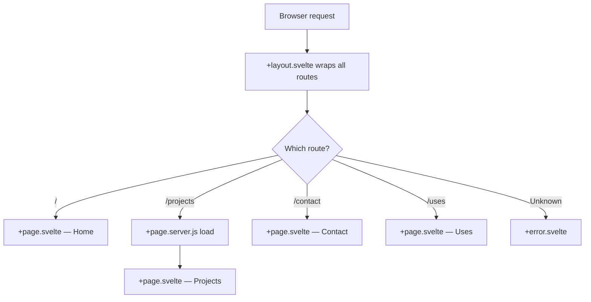

allocazione.dev uses SvelteKit's file-based routing system. Every file named `+page.svelte` inside `src/routes/` automatically becomes a URL route — no manual route registration required.

## How file-based routing works

SvelteKit maps the filesystem path of a `+page.svelte` file directly to a URL:

| File | URL |
|------|-----|
| `src/routes/+page.svelte` | `/` |
| `src/routes/projects/+page.svelte` | `/projects` |
| `src/routes/contact/+page.svelte` | `/contact` |
| `src/routes/uses/+page.svelte` | `/uses` |

The `+` prefix is SvelteKit's convention for special framework files, distinguishing them from regular component files.

## The four main routes

<Columns cols={2}>
  <Card title="Home — /" icon="house">
    The main landing page. Displays the bento-grid layout with widgets including the live clock, StatsFM music card, and introductory content.
  </Card>
  <Card title="Projects — /projects" icon="folder-open">
    Lists personal and open-source projects. Data is loaded server-side via `+page.server.js` and rendered into project cards.
  </Card>
  <Card title="Contact — /contact" icon="envelope">
    Contact information and social links. Static content rendered from `$lib/config.js`.
  </Card>
  <Card title="Uses — /uses" icon="wrench">
    A curated list of tools, hardware, and software used day-to-day.
  </Card>
</Columns>

## The root layout

`src/routes/+layout.svelte` wraps every page in the application. It renders the global navigation and applies the base page structure:

```svelte
<script>
  import Nav from '$lib/components/ui/Nav.svelte';
  import ScrollingText from '$lib/components/ui/Ticker.svelte';
  import '../app.css';
</script>

<ScrollingText />
<Nav />
<slot />
```

`<slot />` (or `{@render children()}` in Svelte 5 snippet syntax) is where the active `+page.svelte` content is injected. Because this layout is at the root of `src/routes/`, it applies to every route.

### `+layout.js` — prerendering

The `+layout.js` file exports SvelteKit page options for the entire route tree. For a static site, prerendering is enabled globally:

```javascript
// src/routes/+layout.js
export const prerender = true;
```

This tells `@sveltejs/adapter-static` to crawl and pre-render all routes at build time, producing plain HTML files for each URL.

<Note>
  Individual routes can override `prerender` by exporting their own value from a `+page.js` or `+page.server.js` file.
</Note>

## Server-side data loading

When a page needs data before rendering, you add a `+page.server.js` file alongside the `+page.svelte`. SvelteKit calls the exported `load` function on the server and passes the return value as the `data` prop to the page component.

### Example: `/projects`

```javascript
// src/routes/projects/+page.server.js
import { projects } from '$lib/config.js';

export const load = () => {
  return {
    projects
  };
};
```

```svelte
<!-- src/routes/projects/+page.svelte -->
<script>
  let { data } = $props();
  const { projects } = data;
</script>

{#each projects as project}
  <!-- render each project card -->
{/each}
```

Because the project uses `adapter-static` with `prerender = true`, `load` functions in `+page.server.js` files run at **build time**, not at request time. The result is baked directly into the pre-rendered HTML.

<Warning>
  Server-only files (`+page.server.js`, `hooks.server.js`) must never import client-side modules (e.g., browser APIs). They run in a Node.js context during build or at request time on the server.
</Warning>

## The error page

`src/routes/+error.svelte` is rendered automatically whenever SvelteKit encounters an unhandled error or a 404. It receives the `page` store from `$app/stores` with the HTTP status and message:

```svelte
<!-- src/routes/+error.svelte -->
<script>
  import { page } from '$app/stores';
</script>

<div class="error-container">
  <h1>{$page.status}</h1>
  <p>{$page.error?.message}</p>
</div>
```

Because it lives at the root of `src/routes/`, this error page applies to all routes.

## Navigation

The `Nav` component in `+layout.svelte` renders links to each main route. SvelteKit's `<a>` tags use client-side navigation by default — clicking a link swaps the page content without a full browser reload, preserving the layout.

The active route is detectable via the `page` store:

```svelte
<script>
  import { page } from '$app/stores';
</script>

<nav>
  <a href="/" class:active={$page.url.pathname === '/'}>Home</a>
  <a href="/projects" class:active={$page.url.pathname === '/projects'}>Projects</a>
  <a href="/uses" class:active={$page.url.pathname === '/uses'}>Uses</a>
  <a href="/contact" class:active={$page.url.pathname === '/contact'}>Contact</a>
</nav>
```

## Routing summary


